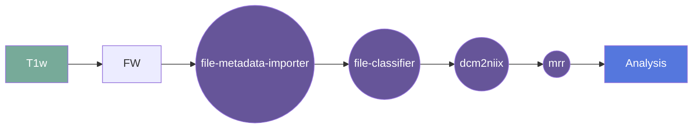

# ANTs Tissue Segmentation

## Overview

This script is designed to run the ANTs pipeline for segmenting infant brain images on Flywheel. The pipeline consists of the following steps:
1. Register the input image to a template image
2. Apply the registration to the input image
3. Segment the input image in template space using ANTs Atropos
4. Move the segmentations back to native space

The script assumes that the input image is in NIfTI format. The script outputs the segmentations in native space.

[Usage](#usage)

This script is designed to be run as a Flywheel Gear. The script takes two inputs:
1. The input image to segment
2. The age of the template to use in months (e.g. 3, 6, 12, 24)

[FAQ](#faq)

### Summary

### Cite

**license:**

**url:** <https://gitlab.com/flywheel-io/flywheel-apps/>

**cite:**  
Fast and sequence-adaptive whole-brain segmentation using parametric Bayesian modeling. O. Puonti, J.E. Iglesias, K. Van Leemput. NeuroImage, 143, 235-249, 2016.

### Classification

*Category:* analysis

*Gear Level:*

* [ ] Project
* [x] Subject
* [x] Session
* [ ] Acquisition
* [ ] Analysis

----

### Inputs

* api-key
  * **Name**: api-key
  * **Type**: object
  * **Optional**: true
  * **Classification**: api-key
  * **Description**: Flywheel API key.

### Config

* Age
  * **Name**: age
  * **Type**: string
  * **Description**: age in months of the template to use
  * **Default**: None

* input
  * **Base**: file
  * **Description**: input file (usually isotropic reconstruction)
  * **Optional**: false

### Outputs
* output
  * **Base**: file
  * **Description**: segmentated file 
  * **Optional**: false

* parcelation
  * **Base**: file
  * **Description**: parcelation nifti files for visual QC
  * **Optional**: true

* volume
  * **Base**: file
  * **Description**: volume estimation file (csv)
  * **Optional**: true

#### Metadata

No metadata currently created by this gear

### Pre-requisites

- Three dimensional structural image

#### Prerequisite Gear Runs

This gear runs on BIDS-organized data. To have your data BIDS-ified, it is recommended
that you run, in the following order:

1. ***dcm2niix***
    * Level: Any
2. ***file-metadata-importer***
    * Level: Any
3. ***file-classifier***
    * Level: Any

#### Prerequisite

## Usage

This section provides a more detailed description of the gear, including not just WHAT
it does, but HOW it works in flywheel

### Description

This gear is run at either the `Subject` or the `Session` level. It downloads the data
for that subject/session into the `/flwyhweel/v0/work/` folder and then runs the
`ants-segmentation` pipeline on it.

After the pipeline is run, the output folder is zipped and saved into the analysis
container.

#### File Specifications

This section contains specifications on any input files that the gear may need

### Workflow

A picture and description of the workflow

Description of workflow

1. Upload data to container
2. Prepare data by running the following gears:
   1. file metadata importer
   2. file classifier
   3. dcm2niix
3. Select either a subject or a session.
4. Run the MRR gear (Hyperfine multi-resolution registration)
5. Run the ants-segmentation gear

### Use Cases

## FAQ

[FAQ.md](FAQ.md)

## Contributing

[For more information about how to get started contributing to that gear,
checkout [CONTRIBUTING.md](CONTRIBUTING.md).]
